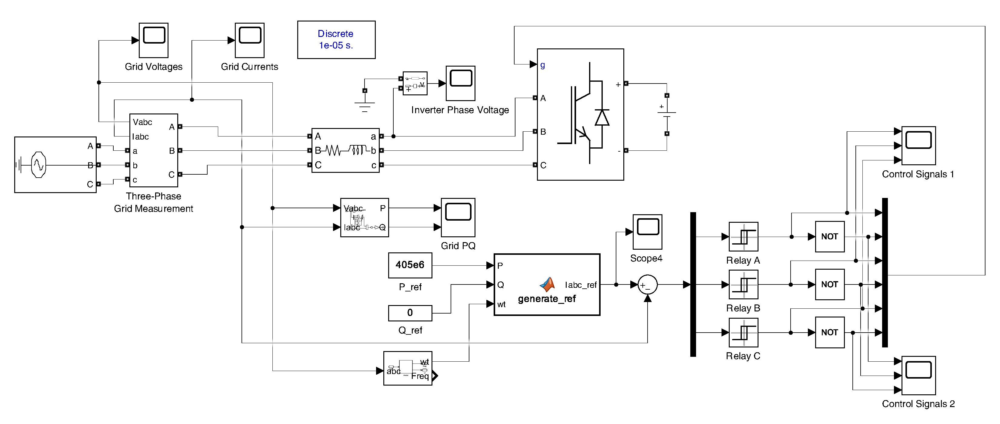

# Grid-Connected Two-Level VSC for HVDC: Hysteresis Current Control

## 🚀 Overview
MATLAB/Simulink model of a grid-connected **two-level Voltage Source Converter (VSC)**, the basic building block of VSC-HVDC systems. The VSC regulates **active (P) and reactive (Q) power independently** while exchanging power with a stiff **90 kV (peak), 50 Hz** AC grid through an R-L filter.

## 🎯 Problem Statement
Implement a **hysteresis current controller directly in the abc frame** and evaluate five operating cases:
1. **Pure active injection:** P = +405 MW, Q = 0.
2. **Symmetrical injection:** P = +200 MW, Q = +200 MVAR.
3. **STATCOM operation:** P = 0, Q = +405 MVAR.
4. **Rectification:** P = −405 MW, Q = 0.
5. **Dynamic step:** power reversal from +405 MW to −405 MW at t = 0.05 s.

## 🧠 Control Strategy
No dq0 transformation or inner PI tuning is needed; a non-linear hysteresis controller is used instead.

1. **Reference generation:** a MATLAB function (`generate_ref.m` in the report sources) creates the three-phase reference currents Iabc* from the target P and Q and the power-factor angle φ = tan⁻¹(Q/P).
2. **Hysteresis switching:** measured currents are kept inside a tolerance band (±Δi) by relay blocks, which produce complementary gate signals for the upper and lower IGBTs of each leg.

## ⚙️ Results by Case
| Case | Result |
| :--- | :--- |
| 1 | Unity power factor; grid currents in phase with grid voltages. |
| 2 | Power-factor angle of 45° with equal P and Q. |
| 3 | Zero active power; currents shifted by 90° (reactive injection only). |
| 4 | Bidirectional operation: 180° phase shift of the currents when power is drawn from the grid. |
| 5 | Active-power reversal within a fraction of an AC cycle, with P and Q regulated independently. |

### Dynamic response (Case 5)
| Active & Reactive Power Reversal | Grid Current 180° Phase Shift |
| :---: | :---: |
|  |  |

## 📂 Repository Structure
* `Simulation/vsc-hvdc-hysteresis-control.slx` — Simulink model: VSC, split-capacitor DC link and hysteresis controller.
* `Docs/vsc-hvdc-hysteresis-control.pdf` — report with theory, equations and waveform analysis.
* `Docs/LaTeX_Source/` — LaTeX source, `generate_ref.m` and plots.

## ▶️ How to Run
Open `Simulation/vsc-hvdc-hysteresis-control.slx` in MATLAB/Simulink (Simscape Electrical required) and press **Run**.

## 👨‍💻 Author
**Abd El-Rhman Muhammad Saad** — Electrical Power and Machines Engineering, Alexandria University.
[LinkedIn](https://linkedin.com/in/Abd-El-Rhman-Saad) · [GitHub](https://github.com/Abd-El-Rhman-Saad)

*Completed as part of the HVDC Transmission Systems coursework.*
